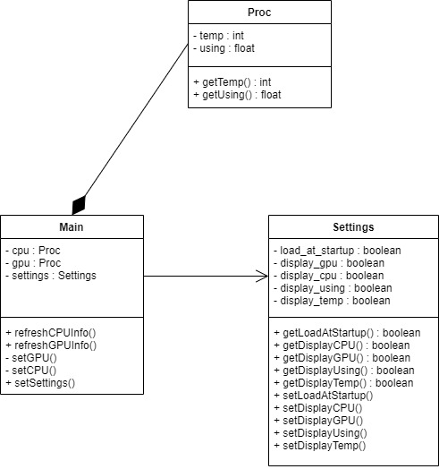

# CPU-Monitor
## Description
Création d'un utilitaire de monitoring desktop pour voir l'état des processeurs en tray

## Objectif
- Récupérer les informations CPU
- Récupérer les informations GPU si disponible
- Intégrer les informations dans un tray personnalisé comme Windows "actualité et centre d'intérêt"
- Choix de l'affichage de la GPU
- Choix de la fréquence de rafraichissement

## UML
